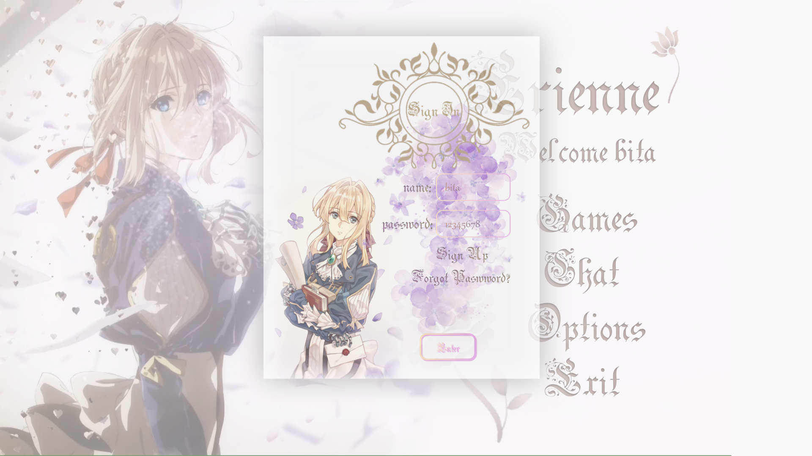
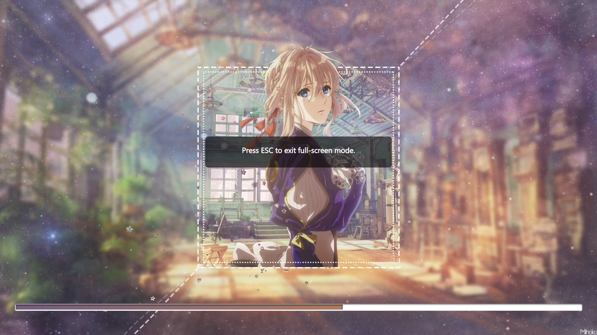
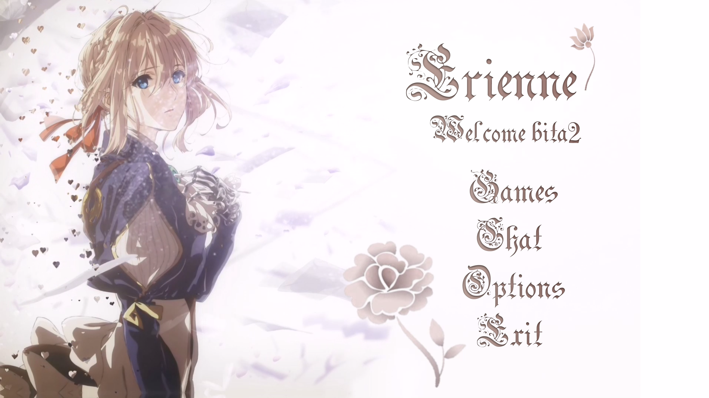
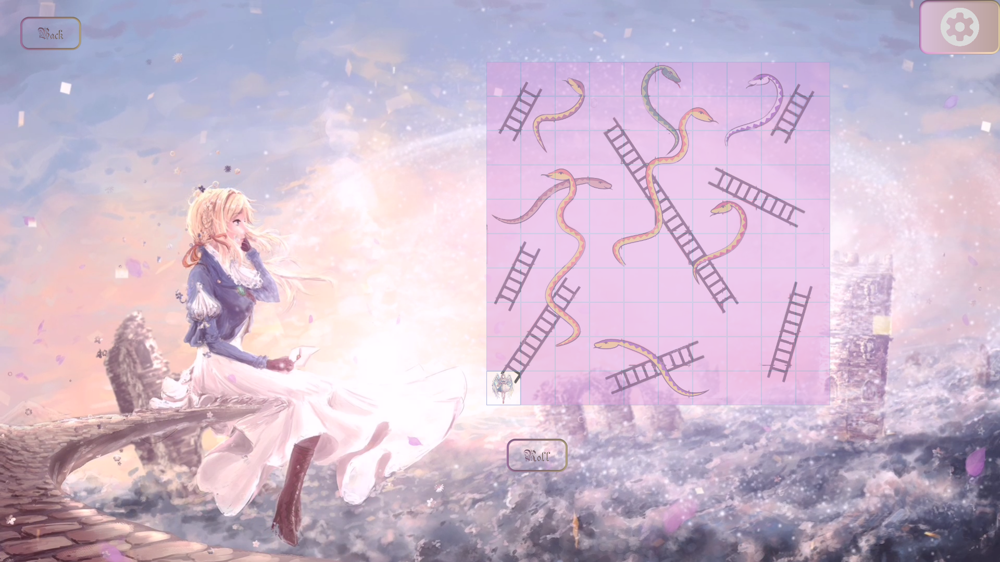
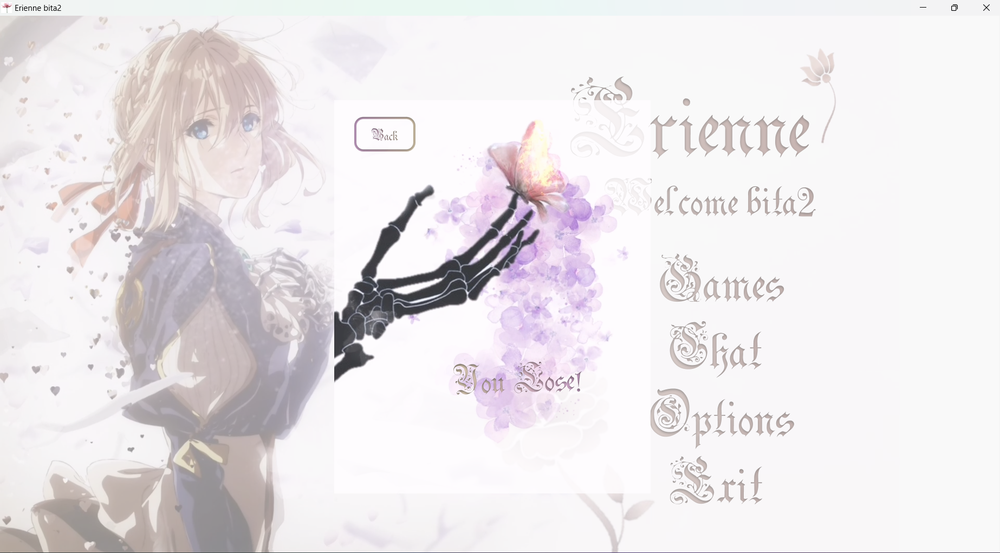

# Erinne game platform (JavaFX Project)
This project is my OOP final project with Dr. Mostafa Nouri Baygi ([Webpage](http://prof.um.ac.ir/nouribaygi)), focusing on creating a multi-feature gaming platform using JavaFX. The application provides single-player and two-player games with chat functionality.

## Features

### User Management
- **User Registration & Login**: Secure user sign-up and sign-in features, along with password recovery.
- **Field Validation**: Different types of validation for user input fields.
- **User Settings**: Personalize settings, including sound adjustments.

### Gaming & Chat Functionality
- **Single-Player Games**: Various games that can be played against the computer.
  - **Minimax Algorithm**: Implemented for the computer's opponent for a challenging gaming experience.
- **Two-Player Games with Chat**: Real-time communication while playing games with other users.
  - **Socket Server**: A server is used to handle the chat and two-player games, ensuring seamless interaction.
- **Add Friends**: Add friends to play two-player games and chat simultaneously.

### Design & User Interface
- **Attractive Design**: The platform is designed with a visually appealing interface and special effects.
- **JavaFX Animations**: Utilizes various JavaFX animation capabilities to enhance user experience.
- **Fully Responsive**: The design adapts to different screen sizes for an optimal user experience.

### Backend Features
- **Database**: Stores user information securely for login, game statistics, and user settings.
- **Server-Side Logging**: Logs events and user interactions to the server for monitoring and troubleshooting.

## Technologies Used
- **JavaFX**: For front-end GUI and animations.
- **Socket Programming**: For real-time chat and two-player interactions.
- **Minimax Algorithm**: Implemented for intelligent gameplay in single-player games.
- **SQL Database**: To store and manage user data.

## Screenshots
- Authentication: 

   
   
   

- Setting:

   
   
   

- Game setting:

   
   
   
   

- Game display:

   
   
   

## Usage
- Register as a new user or log in if you already have an account.
- Choose between single-player or two-player games.
- In two-player mode, add friends and chat with them during gameplay.
- Access and modify sound and user settings through the settings menu.

## Contribution
If you wish to contribute:
- Fork the repository.
- Make your changes.
- Submit a pull request with a description of your changes.

## License
This project is licensed under the MIT License. See the `LICENSE` file for details.
